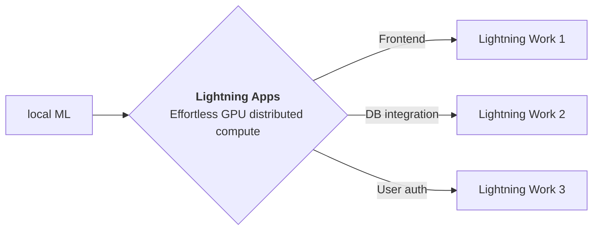

<div style="height: 90pt;"></div>
<div style="flex: 0 0 16%; margin-top: -10pt;">

</div>
<div style="flex: 0 0 65%; text-align: center;">
<h1 style="margin-bottom: 10pt;">Demo: YoloV5</h1>
<h2>A demo of YoloV5 model using Lightning App</h2>
</div>
<div style="flex: 1">
    <div style="display: flex; align-items: center;">
        
        <div style="font-size: 0.9rem; margin-right: 5pt;"><a href="https://github.com/openai/">OpenAI</a></div>
    </div>
    <div style="display: flex; align-items: center;">
        
        <div style="font-size: 0.9rem;"><a href="https://twitter.com/OpenAI">@OpenAI</a></div>
    </div>
</div>

--split--

# YoloV5

## YOLOv5 🚀 in PyTorch > ONNX > CoreML > TFLite

This app is a demo of YoloV5
using [Lightning Research Template app](https://github.com/PyTorchLightning/lightning-template-research-app) which
allows authors to build an app to share their everything related to their work at a single place.
Explore the tabs at the top of this app to view blog, paper, training logs and model demo.

You can fork this app and edit to customize according to your need.

Thanks to [Ultralytics](https://github.com/ultralytics/yolov5) for open-sourcing this fantastic library.


YOLOv5 🚀 is a family of object detection architectures and models pretrained on the COCO dataset, and represents
Ultralytics open-source research into future vision AI methods, incorporating lessons learned and best practices evolved
over thousands of hours of research and development.

--split--

# Lightning Apps

## Lightning Apps can be built for any AI use case, including AI research, fault-tolerant production-ready pipelines, and everything in between.

!!! abstract "Key Features"

    - **Easy to use-** Lightning apps follow the Lightning philosophy- easy to read, modular, intuitive, pythonic and highly composable interface that allows you to focus on what's important for you, and automate the rest.
    - **Easy to scale**- Lightning provides a common experience locally and in the cloud. The Lightning.ai cloud platform abstracts the infrastructure, so you can run your apps at any scale. The modular and composable framework allows for simpler testing and debugging.
    - **Leverage the power of the community-** Lightning.ai offers a variety of apps for any use case you can use as is or build upon. By following the best MLOps practices provided through the apps and documentation you can deploy state-of-the-art ML applications in days, not months.



### Available at : `PyTorchLightning/lightning-template-research-app/app.py`

```python
import lightning as L

paper = "https://arxiv.org/pdf/2103.00020.pdf"
blog = "https://openai.com/blog/clip/"
github = "https://github.com/mlfoundations/open_clip"
wandb = "https://wandb.ai/aniketmaurya/herbarium-2022/runs/2dvwrme5"
tabs = ["Poster", "Blog", "Paper", "Notebook", "Training Logs", "Model Demo"]

app = L.LightningApp(
    ResearchApp(
        resource_path="resources",
        paper=paper,
        blog=blog,
        training_log_url=wandb,
        github=github,
        notebook_path="resources/Interacting_with_CLIP.ipynb",
        launch_jupyter_lab=True,
        launch_gradio=True,
        tab_order=tabs,
    )
)
```

### Citation

```bibtex

@article{YourName,
  title={Your Title},
  author={Your team},
  journal={Location},
  year={Year}
}

```
